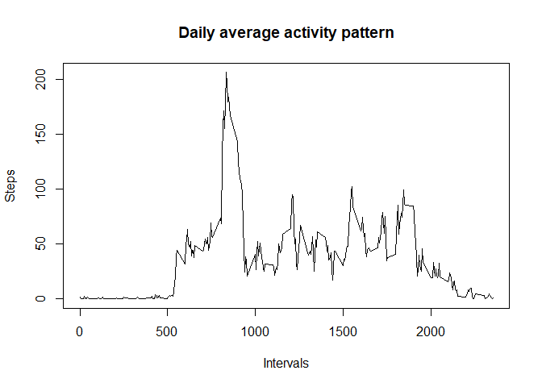

## Introduction
This is the output from the R Markdown produced for Assignment 1 of the Reproducible Research course.

## Loading and preprocessing the data
The source data has been downloaded from https://d396qusza40orc.cloudfront.net/repdata%2Fdata%2Factivity.zip and unzipped into the working directory.  

Load the data into a dataframe and convert the date field to the date class.

```r
startdata <- read.csv("activity.csv")
startdata$date <- as.Date(startdata$date, format="%Y-%m-%d")
```
## Mean total steps per day
Calculate the total number of steps per day and plot as a histogram.

```r
dailysteps <- as.vector(tapply(startdata$steps, startdata$date, FUN="sum", na.rm=TRUE))
hist(dailysteps, breaks = 24, main="Histogram of total daily steps", xlab="Total Daily Steps", ylab="Number of days")
```

<!-- -->

```r
# calculate the mean and median daily steps
meansteps <- mean(dailysteps, na.rm = TRUE)
mediansteps <- median(dailysteps, na.rm = TRUE)
meansteps
```

```
## [1] 9354.23
```

```r
mediansteps
```

```
## [1] 10395
```
The mean number of steps per day is 9354.23 and the median is 10395.

## Daily activity pattern
The following time series plot shows the average number of steps taken per 5 minute time interval, over the 2 month observation period.

```r
# derive mean steps per interval over the observation period and plot
intSteps <- aggregate(list(steps=startdata$steps), by = list(interval = startdata$interval), FUN = "mean", na.rm = TRUE)
plot(intSteps$interval, intSteps$steps, type = "l", main = "Daily average activity pattern", xlab = "Intervals", ylab = "Steps")
```

<!-- -->

```r
# identify the interval with the highest average steps
maxIntSteps <- max(intSteps$steps)
maxInt <- intSteps[intSteps$steps==maxIntSteps, ]
maxInt
```

```
##     interval    steps
## 104      835 206.1698
```
The interval with the highest average number of steps is 835 with an average of 206 steps.

## Identifying and imputing missing values
Identify and count the rows with missing values.

```r
missing <- is.na(startdata$steps)
totmissing <- sum(missing)
totmissing
```

```
## [1] 2304
```
The number of rows with missing steps values is 2304.

A new dataset is created with the missing values imputed with the average number of (non-missing) steps per interval. The new dataset is then used to recalculate the total steps per day to produce a histogram which can be compared to the equivalent histogram based on the data without imputed values.

```r
newSteps <- startdata
newSteps$steps <- ifelse(missing, intSteps[newSteps$interval,]$steps, newSteps$steps)

# calc new daily totals including imputed values
NewDailyTot <- as.vector(tapply(newSteps$steps, newSteps$date, FUN="sum", na.rm=TRUE))

# plot the histogram
par(mfrow=c(2,1))
hist(dailysteps, breaks = 24, main="Histogram of total daily steps (missing)", xlab="Total Daily Steps", ylab="Number of days")
hist(NewDailyTot, breaks = 24, main="Histogram of total daily steps (imputed)", xlab="Total Daily Steps", ylab="Number of days")
```

<!-- -->

```r
newmeansteps <- mean(NewDailyTot, na.rm = TRUE)
newmediansteps <- median(NewDailyTot, na.rm = TRUE)
newmeansteps
```

```
## [1] 9545.514
```

```r
newmediansteps
```

```
## [1] 10395
```
With imputed values the average number of daily steps has increased to 9545.51 and the median is unchanged at 10395. Comparing the charts it is evident that the main effect of imputing has been to shift days showing very low total steps, and therefore not impacted the median.

## Activity patterns on weekdays and weekends
By introducing a new factor (based on date) we can compare the average activity patterns on weekdays and weekends.

```r
# create new factor
newSteps$weekday <- as.factor(ifelse(weekdays(newSteps$date) %in% c("Saturday","Sunday"), "Weekends", "Weekdays"))

# calculate average steps per interval, split between weekdays and weekends
weekdaySummary <- aggregate(list(steps=newSteps$steps), by = list(interval=newSteps$interval, weekday=newSteps$weekday), FUN = "mean", na.rm = TRUE)

library(ggplot2)
```

```
## Warning: package 'ggplot2' was built under R version 4.0.3
```

```r
qplot(x=interval, y=steps, data = weekdaySummary, facets = weekday ~ ., geom = "path", xlab = "Intervals", ylab = "Steps")
```

<!-- -->

As might be expected, the activity patterns are different. There is higher activity on weekdays before 8am, perhaps indicating a morning commute to work. There is a similar spike of activity between 8am and 9am throughout the week - perhaps indicating a morning exercise routine. There is a lower level of activity during the rest of the daylight hours on weekdays, perhaps indicating a sedentary job.
